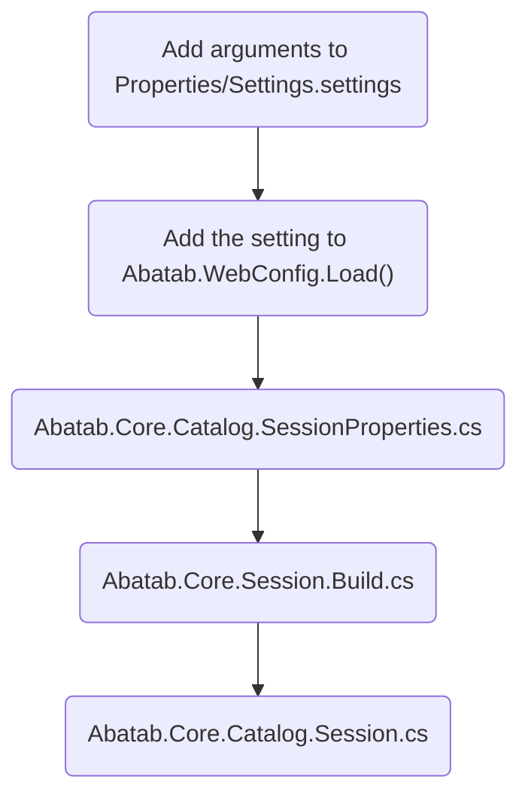

# Adding new settings

> Last updated February 25, 2023

# Local settings

Abatab local settings are stored in the local Web.config file, which is created when the project is built.

This document will detail how to add a new local setting to Abatab.


<div align="center">



</div>

## Add the setting to Settings.settings

Simply add the new setting/value to the file.

## Add the setting to WebConfig.Load()

For example, to add the `AbatabDataRoot` setting, you would take the webConfig Dictionary in Abatab.WebConfig.Load():

```
{ "AbatabMode",                             Settings.Default.AbatabMode.ToLower() },
{ "AbatabRoot",                             Settings.Default.AbatabRoot.ToLower() },
```

And add a line for `AbatabDataRoot`:

```
{ "AbatabMode",                             Settings.Default.AbatabMode.ToLower() },
{ "AbatabRoot",                             Settings.Default.AbatabRoot.ToLower() },
{ "AbatabDataRoot",                         Settings.Default.AbatabDataRoot.ToLower() },
```

## Add the setting to Abatab.Core.Catalog.SessionProperties.cs

Just add the setting where it belongs.

## Add setting to Abatab.Core.Session.Build.cs

For example, to add the `AbatabDataRoot` setting, you would take the webConfig Dictionary in Abatab.WebConfig.Load():

```
var abatabSession = new Session
{
    AbatabMode             = webConfig["AbatabMode"],
    AbatabRoot             = $@"{webConfig["AbatabRoot"]}{webConfig["AvatarEnvironment"]}"
};
```

And add a line for `AbatabDataRoot`:

```
var abatabSession = new Session
{
    AbatabMode             = webConfig["AbatabMode"],
    AbatabRoot             = $@"{webConfig["AbatabRoot"]}{webConfig["AvatarEnvironment"]}",
    AbatabDataRoot         = $@"{webConfig["AbatabDataRoot"]}\{webConfig["AvatarEnvironment"]}"
};
```

## Add setting to Abatab.Core.Catalog.Session.cs

Add the new setting here so it's exported with logfiles.