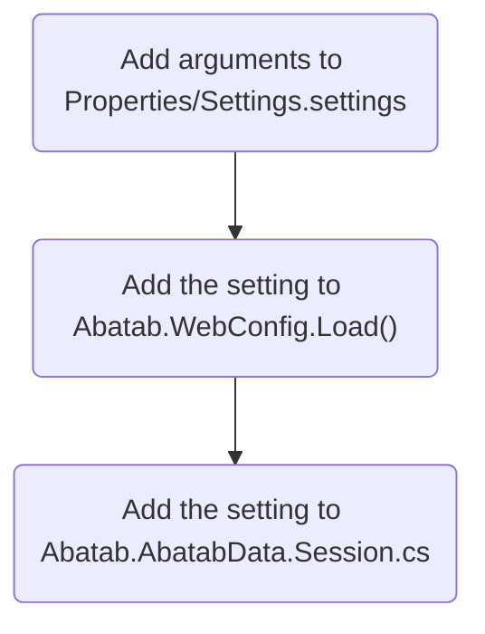

<div align="center">

![Logo][Logo]

# ADDING A NEW LOCAL SETTING

<h5>
  Last updated Feburary 21, 2023
</h5>

</div>

# Overview

<div align="center">



</div>

<br><br><br><br><br><br><br><br><br><br><br><br><br><br><br><br>
<br><br><br><br><br><br><br><br><br><br><br><br><br><br><br><br>
<br><br><br><br><br><br><br><br><br><br><br><br><br><br><br><br>
<br><br><br><br><br><br><br><br><br><br><br><br><br><br><br><br><br><br><br><br><br><br><br><br><br><br><br><br><br><br><br><br>
<br><br><br><br><br><br><br><br><br><br><br><br><br><br><br><br><br><br><br><br><br><br><br><br><br><br><br><br><br><br><br><br>
<br><br><br><br><br><br><br><br><br><br><br><br><br><br><br><br><br><br><br><br><br><br><br><br><br><br><br><br><br><br><br><br>
<br><br><br><br><br><br><br><br><br><br><br><br><br><br><br><br><br><br><br><br><br><br><br><br><br><br><br><br><br><br><br><br>
<br><br><br><br><br><br><br><br><br><br><br><br><br><br><br><br><br><br><br><br><br><br><br><br><br><br><br><br><br><br><br><br>
<br><br><br><br><br><br><br><br><br><br><br><br><br><br><br><br>

## Add setting to WebConfig

For example, to add the `AbatabDataRoot` setting, you would take the webConfig Dictionary in Abatab.WebConfig.Load():

```
{ "AbatabMode",                             Settings.Default.AbatabMode.ToLower() },
{ "AbatabRoot",                             Settings.Default.AbatabRoot.ToLower() },
```

And add a line for `AbatabDataRoot`:

```
{ "AbatabMode",                             Settings.Default.AbatabMode.ToLower() },
{ "AbatabRoot",                             Settings.Default.AbatabRoot.ToLower() },
{ "AbatabDataRoot",                         Settings.Default.AbatabDataRoot.ToLower() },
```

# Adding new local settings

1. Add the setting to Properties/Settings.settings
2. Open Web.config and copy/paste the setting where it belongs
3. Add an entry in Abatab.WebConfig.Load()
4. Add the setting to Abatab.Core.AbatabData.Session.cs
5. Add the proper logic to Abatab.Core.AbatabSession.Build()
