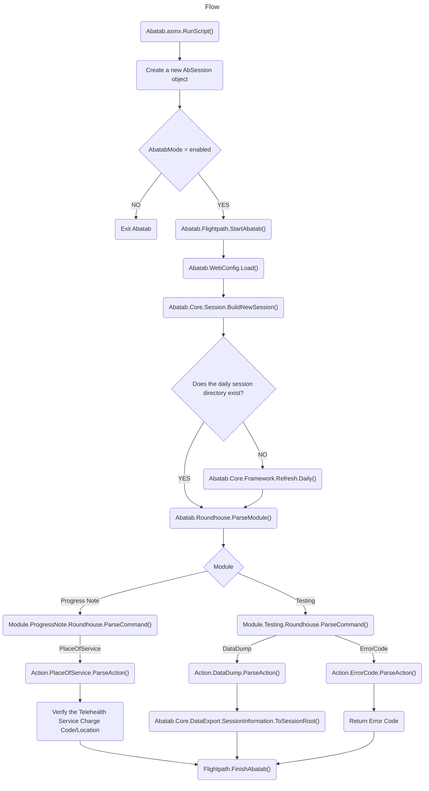

## Program

> Last updated 230306.0907

```mermaid
---
title: Flow
---
graph TD

  RunScript("Abatab.asmx.RunScript()") --> NewAbSessionObject("Create a new AbSession object")
  NewAbSessionObject --> AbatabIsEnabled{AbatabMode = enabled}
 
  AbatabIsEnabled -- NO --> ExitApp(Exit Abatab)
  AbatabIsEnabled -- YES --> StartAbatab("Abatab.Flightpath.StartAbatab()")
  StartAbatab --> LoadLocalSettings("Abatab.WebConfig.Load()")
  LoadLocalSettings --> BuildNewSession("Abatab.Core.Session.BuildNewSession()")
  
  BuildNewSession --> DailySessionDirExists{"Does the daily session directory exist?"}
  DailySessionDirExists -- YES --> ParseModule("Abatab.Roundhouse.ParseModule()")
  DailySessionDirExists -- NO --> CreateDailySessionDir("Abatab.Core.Framework.Refresh.Daily()")
  CreateDailySessionDir --> ParseModule

  ParseModule --> Module{Module}
  Module -- Testing --> TestingModule("Module.Testing.Roundhouse.ParseCommand()")
  Module -- Progress Note --> ProgressNoteModule("Module.ProgressNote.Roundhouse.ParseCommand()")

  ProgressNoteModule -- PlaceOfService --> PlaceOfService("Action.PlaceOfService.ParseAction()")
  PlaceOfService --> VerifyTelehalthLoc(Verify the Telehealth Service Charge Code/Location)
  VerifyTelehalthLoc --> FinishAbatab("Flightpath.FinishAbatab()")

  TestingModule -- DataDump --> TestingDataDump("Action.DataDump.ParseAction()")
  TestingDataDump --> ExportSessionData("Abatab.Core.DataExport.SessionInformation.ToSessionRoot()")
  ExportSessionData --> FinishAbatab("Flightpath.FinishAbatab()")

  TestingModule -- ErrorCode --> TestingErrorCode("Action.ErrorCode.ParseAction()")
  TestingErrorCode --> ReturnErrorCode(Return Error Code)
  ReturnErrorCode --> FinishAbatab("Flightpath.FinishAbatab()")

```

