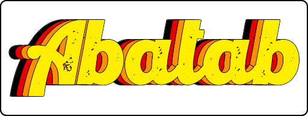

<!-- 
	Last updated: 231030
-->

  

 

***

  <h1>

  THIS IS THE DEVELOPMENT BRANCH OF ABATAB!

  DO NOT USE!

  </h1>

***

# DO NOT USE!

While this is the main repository, I'm using it to test documentation updates for v23.11.

***SO DO NOT USE IT***

- [Abatab API documentation](https://spectrum-health-systems.github.io/Abatab/)
- [Abatab Documentation Project](https://github.com/spectrum-health-systems/Abatab-Documentation-Project/blob/main/README.md)

***

  Abatab is developed by 
  [A Pretty Cool Program](https://github.com/APrettyCoolProgram)

