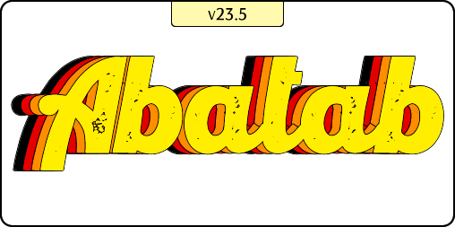

  
  
  <h5>

  **This is a development branch of Abatab, and is not intended for use in production environments!**

  </h5>

  ***

  

# A custom web service for Netsmart's myAvatar™ EHR

  &nbsp;&nbsp;&nbsp;&nbsp;

# About

[Netsmart's myAvatar™](https://www.ntst.com/Solutions-and-Services/Offerings/myAvatar) is a behavioral health EHR that offers a recovery-focused suite of solutions that leverage real-time analytics and clinical decision support to drive value-based care.

While myAvatar™ is a robust platform, it isn't perfect. The good news is that you can extend myAvatar™ functionality via Netsmart's myAvatar™ Web Services, and/or custom web services that are written by other myAvatar™ users.

**Abatab** is one such custom web service which includes various tools and utilities for myAvatar™ that aren't included in the official release, and provides a solid foundation for building additional functionality quickly and efficiently.

## Features

* Several built-in tools and utilities for use with myAvatar™
* Does not require Java to be installed
* A solid foundation to build additional myAvatar™ custom tools and utilities

## Requirements

* A location to host the Abatab which meets the following requirements:
* .NET Framework 4.8+ installed
* Access to your myAvatar™ environments via HTTPS

### Development requirements

* [ScriptLink Standard](https://github.com/rcskids/ScriptLinkStandard)

 

# Development version -VS- Community Release

# Abatab documentation

> PLEASE NOTE: Abatab documentation is a work in progress, and may be incomplete and/or innacurate.

Please see the [Abatab documentation](https://spectrum-health-systems.github.io/Abatab/).

 

***

Abatab is developed by: 
[A Pretty Cool Program](https://github.com/APrettyCoolProgram)

