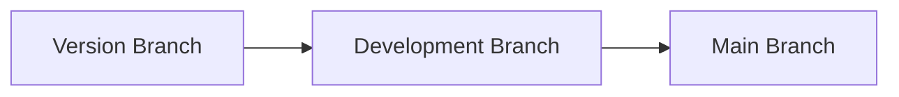

   

   
  
  **AND**
  
  

  **SO...**

  <h2>

  **DO NOT USE IN PRODUCTION ENVIRONMENTS!**

  </h2>

  You are probably looking for the [Abatab Community Release](https://github.com/spectrum-health-systems/Abatab-Community-Release) repository.

   

  ***

   
  
  

   

  &nbsp;&nbsp;&nbsp;&nbsp;

 

# About this repository

This repository is for **development versions** of Abatab, which **are not intended for use in production environments**.

The current development version of Abatab is `v23.5`.

Development versions of Abatab:
* May have broken/missing functionality
* Will have lots of ugly, gross code
* Is extensively commented
* Might not work at all!

## Community Release

If you want to use Abatab in a production environment, you will want the [Abatab Community Release](https://github.com/spectrum-health-systems/Abatab-Community-Release). The Community Release:

* Has been tested in a production environment
* Is released quarterly

The current Community Release of Abatab is [CommunityReleasePreview](https://github.com/spectrum-health-systems/Abatab-Community-Release)

 

# Development workflow

The Abatab development workflow is:

## Version Branch

The majority of development is done in the **Version Branch**, including additions and updates to documentation.

The version branch name is the version being developed (e.g., `23.5`)

The version branch is not deployed to the web service host.

## Development branch

Once the version branch is stable, it is merged with the **Development Branch**.

This is the branch that is deployed to the web service host, and used for testing.

## Main branch

When testing functionality in the development branch is complete, it is merged with the **Main Branch**.

This is the official current development release of Abatab.

## Final release

When a version of Abatab is completed and released, the branch is renamed to `vYY.MM-final`  (e.g., `23.5-final`)

## Other

* [Roadmap](https://github.com/orgs/spectrum-health-systems/projects/25/views/2)

If you are interested in Abatab development, you will need:

* A location to host the Abatab which meets the following requirements:
* .NET Framework 4.8+ installed
* Access to yourmyAvatar™ environments via HTTPS
* [ScriptLink Standard](https://github.com/rcskids/ScriptLinkStandard)

 

***

Abatab is developed by: 
[A Pretty Cool Program](https://github.com/APrettyCoolProgram)

