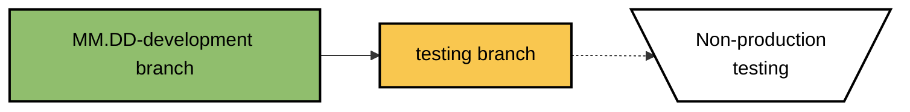
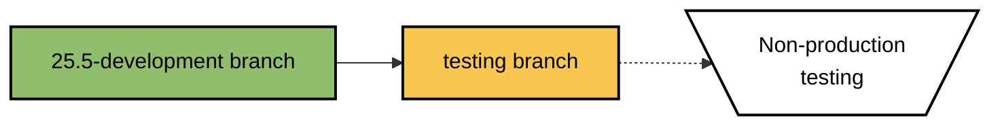

<!--
  README.md for development branches of Abatab.

  Flowcharts:
    - Class names are BackgroundTextBorder
    - Color names/HEX codes from https://coolors.co
-->

   

    

  ***SO...***

  <h2>

  **DO NOT USE THIS SOURCE CODE IN PRODUCTION ENVIRONMENTS!**

  </h2>

  If you want to use Abatab in a production environment, please see the [Abatab Community Release](https://github.com/spectrum-health-systems/Abatab-Community-Release).

  ***

   
  
  

   

  &nbsp;&nbsp;&nbsp;&nbsp;

 

# About this repository

This repository is a **development version** of Abatab, which **is not intended for use in production environments**.

Abatab development, and its repositories are a little different than most source code repositories. This document will detail what those differences are, and why they exist.

If you want to use Abatab in a production environment, please see the [Abatab Community Release](https://github.com/spectrum-health-systems/Abatab-Community-Release).

If you are looking for the most recent stable release of Abatab, please see the Abatab [main branch](https://github.com/spectrum-health-systems/Abatab).

 

# Abatab development

Abatab development takes place in X "Stages".

## **Stage I**: Monthly development branches and testing

The majority of Abatab development takes place in **monthly development branches**, where:

* New functionality is added, and existing functionality is updated/modified
* Bugs are squished
* Code is refactored
* New documentation is added, and existing documentation is updated/modified
* Continual testing is done in a non-production environment

For example (and you can click on these to see where they end up):

### Monthly branch development timeline

```mermaid
%%{init: {'theme':'dark'}}%%
gantt
  title Monthly development timeline
  dateFormat X
  axisFormat %d
  Cleanup/Refactor  : 1, 5d
  Development   : 21d
  Testing   : 5d
```

On the first day of a new month, a new monthly development branch is created from the previous monthly development branch.

Abatab development takes place in the following repositories:

* `MM.DD-development`  
These are the monthly development

 

The current development version branch of Abatab is `v23.6`.

## Things to keep in mind about development version branches

Abatab development version branches:

* May be broken!
* May have missing functionality!
* Will have lots of ugly, gross code!
* Will have extensive comments!
* Might be dangerous to use!

 

 

## Development Version Branch

The majority of development is done in the **development version branch**, including additions and updates to documentation.

The development version branch name is the version being developed (e.g., `23.5d`). Please note the `d` postfix, which indicates that this branch is for development.

The version branch is not deployed to the web service host.

## Development branch

Once the version branch is stable, it is merged with the **Development Branch**.

This is the branch that is deployed to the web service host, and used for testing.

## Main branch

When testing functionality in the development branch is complete, it is merged with the **Main Branch**.

This is the official current development release of Abatab.

### Release types

When a version of Abatab is completed and released, the branch is renamed to `YY.MMx`, where `x` is:

* `d` for development branches that may not be fully functional
* `f` for final branches that have been tested and are fully functional
* stable
* rc
* cr
* hf

 

# Contributing

If you are interested in Abatab development, you will need:

* A location to host the Abatab which meets the following requirements:
* .NET Framework 4.8+ installed
* Access to yourmyAvatar™ environments via HTTPS
* [ScriptLink Standard](https://github.com/rcskids/ScriptLinkStandard)

 

***

Abatab is developed by: 
[A Pretty Cool Program](https://github.com/APrettyCoolProgram)

