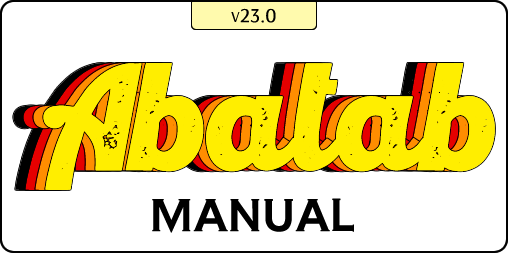

  
   
   
  <h1>
    Appendix
  </h1>

# Hosting Abatab

# Importing Abatab

# Configuring Abatab

> More information about configuring Abatab can be found in the [Abatab Manual][manConfiguringAbatab]

## [*Web.config*][docWebConfig]  
Global settings are stored here.
## The [*session-specfic*][docSessionSettings] settings are created at runtime.

# Using Abatab

# Abatab logging

# Testing Abatab

# Abatab source code

# Abatab and DocFX

***

 
 

***

 
 

# Functionality

## Using existing functionality

## Creating new functionality

***

 
 

# Logging

Abatab has robust logging functionality, including:

* Debug logs
* The [Primeval debug log][primevalDebugLog]
* Trace logs
* Error logs
* Warning logs
* Session logs

You can read more about Abatab logging functionality [here][manLogging].

***

 
 

# OptionObject

> More information about how Abatab utilizes OptionObjects can be found in the [Abatab Manual][docOptionObject].

An **OptionObject** defines the web service contract for use with myAvatar ScriptLink, and provides methods creating, manipulating, and searching OptionObject objects.

You can read more about how Abatab utilizes OptionObjects [here][docOptionObject].

If you are interested in the technical details behind OptionObjects, [ScriptLinkStandard][urlScriptLinkStandard] may be of interest. ScriptLinkStandard is a Class Library designed to assist developers in creating SOAP web services that can be consumed by Netsmart's myAvatar solution using ScriptLink.

***

 
 

# ScriptLink

***

 
 

# Script Parameter
> More information about using Abatab can be found in the [Abatab Manual][manUsing]

> Syntax:  
`MODULE-COMMAND-ACTION[-OPTION]`

The Script Parameter passed from Avatar via a ScriptLink event. It contains the following information:

* The `MODULE` that contains the requested *functionality*
* A `COMMAND` that tells the **module** what specific functionality is *needed*
* An `ACTION` that that tells the **command** what that functionality needs to *do*
* An `OPTION` that provides additional request details for specific functionality.

***

 
 

<!-- Reference Links -->
<!-- Manual-->
[manAbatabManual]: index.md
[manAboutAbatab]: manAboutAbatab.html
[manGettingStartedWithAbatab]: manGettingStartedWithAbatab.html
[manHostingAbatab]: manHostingAbatab.html
[manImportingAbatab]: manImportingAbatab.html
[manConfiguringAbatab]: manConfiguringAbatab.html
[manUsingAbatab]: manUsingAbatab.html
[manAbatabLogging]: manAbatabLogging.html
[manTestingAbatab]: manTestingAbatab.html
[manAbatabSourceCode]: manAbatabSourceCode.html
[manAbatabAndDocFx]: manAbatabAndDocFx.html
<!-- Hosting Abatab documentation  -->
<!-- Importing Abatab documentation -->
<!-- Configuring Abatab documentation -->
[docWebConfig]: URL-NEEDED.html
[docSessionSettings]: URL-NEEDED.html
<!-- Using Abatab documentation -->
[docOptionObject]: URL-NEEDED.html
[urlScriptLinkStandard]: https://github.com/rcskids/ScriptLinkStandard
[docScriptParameter]: URL-NEEDED.html
<!-- Abatab logging documentation -->
<!-- Testing Abatab documentation -->
<!-- Abatab source code documentation -->
<!-- Abatab and DocFX documentation -->
<!-- Appendix documentation -->
